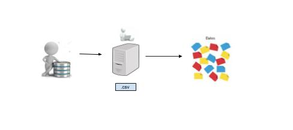

# Segmentación: Ingesta de Datos

# Tabla de Contenido

1. [Resumen](#resumen)
2. [Preprocesos](#preprocesos)

## Resumen

[(Volver al Inicio)](#tabla-de-contenido)

**Alicorp**, cuenta con una amplia cartera de clientes, estando entre ellos las __*bodegas*__. Se ha realizado preprocesos que permiten al interesado obtener bases de datos de gran ayuda para posteriores procesos que tienen como resultado final el cluster al que corresponde el cliente, la estrategia adecuada que se recomienda aplicar y un sistema de recomendación.

## Preprocesos

[(Volver al Inicio)](#tabla-de-contenido)

A continuación se procederá a describir siete preprocesos para obtener las bases de datos que ayudaran a procesos posteriores, y cada preproceso contiene su respectivo flujo de procedimientos.

1. **VENTAS:** La data es obtenida de **QlikSense(.qvd)**, y es trabajada todos los miércoles con la información recolectada de una semana anterior,el siguiente paso es almacenar toda esa data en un servidor, el cual transforma la data en formato csv, teniendo un total de siete datas, a continuación se realiza procesos ya automatizados que cargan la base de datos a **Google Cloud Storage**, después se ejecuta un trigger en **Google Cloud Functions** y se finaliza con la ejecución del gestor de base de datos en PostgreSQL. En la siguiente imagen se observa el flujo completo:

2. **MAESTRO PRODUCTO:** La obtención de la base de datos sigue el mismo proceso que la anterior y en la siguiente imagen se observa el flujo completo:

3. **MAESTRO CLIENTE:** Estos datos se encuentran en formato csv y son facilitados por una persona a cargo. Estos datos contiene el código del cliente, el nombre y la boca salida (B2B y B2C). Y el flujo del proceso esta en la siguiente imagen.

4. **TERRITORIO:** El proceso de la obtención de la base de datos es igual al anterior proceso, y esta contiene el código territorio, el nombre, ID de fuerza de venta y la fuerza de venta.

5. **DISTRIBUIDOR EXCLUSIVO:** La obtención de la base de datos sigue el mismo proceso, donde se encuentra el ID del dex, nombre del dex, ID del cliente actual y el nombre del cliente actual, en la siguiente imagen se observa el flujo completo:

# project-gcs-standard
